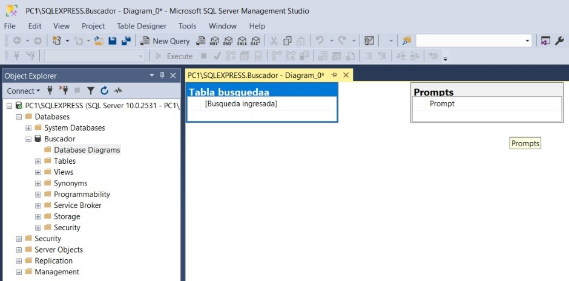

#                                   Investigador
Este proyecto lo hice, utilizando el mismo principio que el proyecto 2 para la
conexión con la API (expuesto en clase), luego la información obtenida se guarda
en una variable que además de mostrar en un RichTextBox (para mostrar bastante
contenido), se guarda en un Word que se genera utilizando OpenXML junto con su librería de Word y el empacador, en este Word se define la
fuente, el tamaño de la letra, la alineación del texto y la formación de los párrafos.

Guarda la misma información dentro de una “presentación” que en realidad
es un PDF con las dimensiones estándar de un PPT, esto ya que no logre crear un PPT que no estuviera corrupto, para crear esta presentación, utilice
las librerías QuestPDF y QuestPDF Infrastructure, para poderbusarlas utilice la
licencia publica para la comunidad, aunque solicite una cuenta gratuita para
proyectos pequeños.

Para hacer el proyecto utilice la API de Open IA, utilizando el modelo o4 mini, que
es, según la página de Open IA, mejor en razonamiento y con la misma velocidad
que el modelo Gpt 4o, siendo esta el doble de cara.
Dentro de SQL se guarda el prompt completo dado al modelo y el tema investigado
que fue ingresado por el usuario.

## Esquema de base de datos:

Jorge Mario Cano Cobón    Carné: 0905 24 10433    Seccion: A
